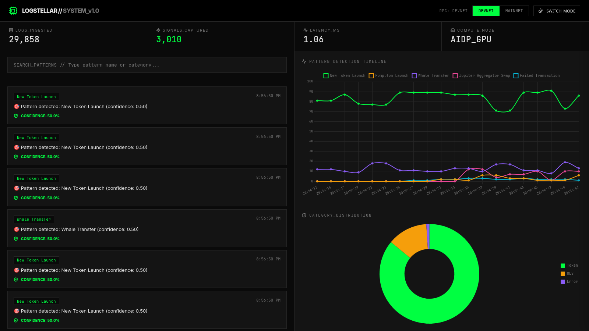

# LogStellar - GPU-Accelerated Solana Log Analyzer

**The Mission:** A Go-based real-time Solana transaction log analyzer using GPU parallelization to scan millions of logs for specific "Signature Patterns" (detecting new liquidity pools, MEV behavior, token launches, and more).



Built for the **AIDP GPU Compute Bounty** 

---

### Prerequisites
- Go 1.25.4 or higher
- Access to Solana RPC (devnet/mainnet)
- AIDP GPU compute access (apply at https://aidp.store)

### Installation

```bash
# 1. Clone/navigate to your project directory
cd logstellar

# 2. Install dependencies
go get github.com/gagliardetto/solana-go

# 3. Build the project
go build -o logstellar

# 4. Run LogStellar
./logstellar
```

### Environment Variables (Optional)

```bash
# Use custom Solana RPC endpoint
export SOLANA_RPC="https://api.mainnet-beta.solana.com"

# Or use devnet (default)
export SOLANA_RPC="https://api.devnet.solana.com"
```

---

## Dashboard

Access the web dashboard at: **http://localhost:8080**

Features:
- Real-time alert feed
- Processing statistics
- GPU efficiency metrics
- Pattern confidence scores
- Live updating (2-second refresh)

---

## GPU Integration (AIDP)

### How LogStellar Uses GPU Compute

Instead of CPU-bound `for` loops, LogStellar:

1. **Batches** 10,000 logs into GPU memory
2. **Parallelizes** pattern matching across all GPU cores
3. **Processes** in microseconds vs. seconds on CPU

### AIDP Integration Steps

1. **Request GPU Access**
   - Visit: https://aidp.store
   - Fill GPU access request form
   - Wait for approval

2. **Configure AIDP Endpoint**
   ```go
   // In gpu/scanner.go, update to use AIDP compute endpoint
   scanner.UseAIDPCompute("your-aidp-endpoint")
   ```

3. **Run Workload**
   ```bash
   ./logstellar --gpu-provider=aidp
   ```
